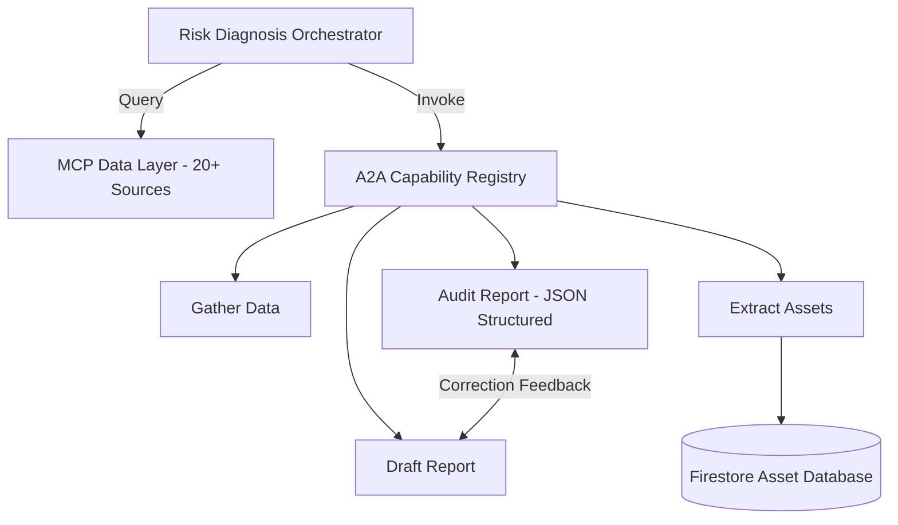

# Architectural Deep-Dive: Dynamic A2A Orchestration

This system deviates from traditional rigid, graph-based agent pipelines. Instead, it utilizes a **Capability-Registry Pattern**.

## Key Design Principles
*   **Decoupling:** Sub-agents are decoupled from the Orchestrator. They expose `Capability Tools` defined in `A2A Wrappers` (using the `@agent_capability` decorator).
*   **Dynamic Discovery:** The Orchestrator does not follow hard-coded execution edges. It performs runtime tool discovery using LLM reasoning to determine the next agent capability required based on the task state.
*   **Federation:** The system uses MCP to abstract data sources, allowing the Orchestrator to interact with 20+ heterogeneous data providers via a unified interface, independent of the underlying API implementation.

## System Architecture

